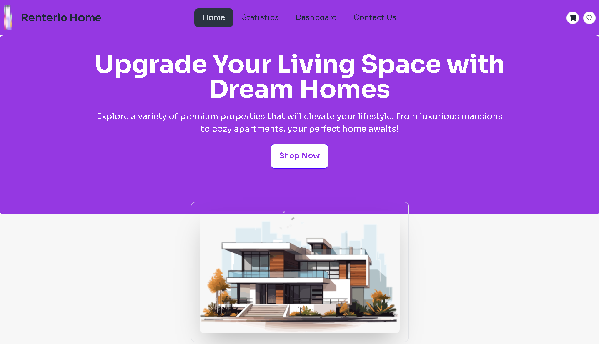

# Renterio Home

**Renterio Home** is an e-commerce platform that enables users to browse and filter products dynamically, manage their shopping cart, and enjoy a seamless, responsive experience across devices. The platform uses React fundamentals to ensure smooth functionality and a user-friendly interface, with local storage for persistence.

## Live Website Link
[Live Website Link](https://observant-beef.surge.sh/)

## React Fundamental Concepts Used

This project employs several key React fundamentals, including:

1. **Components** - Building reusable UI components.
2. **Props** - Passing data between components.
3. **State Management** - Managing component-level state.
4. **useEffect** - Handling side effects such as fetching data.
5. **Context API and Local Storage** - For managing and persisting data across sessions.

## Data Handling and Management

The project uses **Context API** for global state management and **Local Storage** for persisting user preferences and cart data. This combination allows for efficient data handling and storage, ensuring a seamless user experience.

## Key Features

1. **Dynamic Category Filtering**: Users can filter products by categories to quickly find what they're looking for.
2. **Responsive Design**: The site is optimized for various screen sizes, ensuring a smooth experience across devices.
3. **Nested Layouts**: Efficiently structured layouts for Sidebar and Main Segment, making navigation intuitive.
4. **Interactive Error Page**: A custom, visually appealing 404 error page enhances the UX.
5. **Persistent Cart**: Items added to the cart are saved using local storage, allowing users to return to their saved items later.

## Technologies Used

- **Frontend**: React.js, Tailwind CSS, DaisyUI, React Router, React Icons, SweetAlert2, React Toastify
- **Backend**: None (Frontend only)
- **State Management**: Context API, Local Storage
- **Design**: Responsive Design, Custom Error Page

## Dependencies

### Core Dependencies
- `firebase` - Cloud storage and authentication.
- `localforage` - For client-side data storage.
- `match-sorter` - A utility for sorting and filtering.
- `react` - Core library for building the user interface.
- `react-dom` - For DOM-related rendering operations in React.
- `react-icons` - Provides popular icons as React components.
- `react-rating` - Adds rating components for products.
- `react-router-dom` - For handling routing and navigation.
- `react-tabs` - For implementing tabbed navigation.
- `react-toastify` - Provides toast notifications for events and actions.
- `sort-by` - Sorting utility for data.
- `sweetalert2` - For elegant pop-up notifications and alerts.

### Dev Dependencies
- `@eslint/js` - For linting JavaScript code.
- `@types/react` - TypeScript types for React.
- `@types/react-dom` - TypeScript types for React DOM.
- `@vitejs/plugin-react` - Vite plugin for React projects.
- `autoprefixer` - For adding vendor prefixes to CSS.
- `daisyui` - Tailwind CSS plugin for UI components.
- `eslint` - JavaScript linter.
- `eslint-plugin-react` - React-specific linting rules.
- `eslint-plugin-react-hooks` - Linting rules for React Hooks.
- `eslint-plugin-react-refresh` - Linting for React fast refresh.
- `globals` - For global variables in the project.
- `postcss` - Tool for processing CSS.
- `tailwindcss` - For utility-first CSS styling.
- `vite` - Fast build tool for modern web projects.

## Key Sections

### Home Page
- **Banner**: A welcoming interface with dynamic content.
- **Category Filtering**: A category filter to easily browse products.
- **Stats Section**: Displays product, user, and category counts.

### Product Listings
- Users can browse through product listings, filtering by category and searching for specific items.

### Shopping Cart
- Users can add products to their cart and persist their selections using local storage.

### Error Page
- A custom-designed 404 error page appears when users navigate to non-existent routes.

### Responsive Design
- Optimized for desktop, tablet, and mobile devices to provide a consistent experience across all screen sizes.

## Deployment

This project uses:
- **TailwindCSS** for styling with utility classes.
- **Firebase** for cloud-based features (if required).
- **React Router** for page navigation.
- **Vite** as the build tool for fast performance.

## Additional Information

For seamless deployment, ensure your project is connected to Firebase (if necessary) and test routes for proper functionality. The project is fully responsive and optimized for smooth browsing across various devices.

For any questions or assistance, feel free to reach out!
